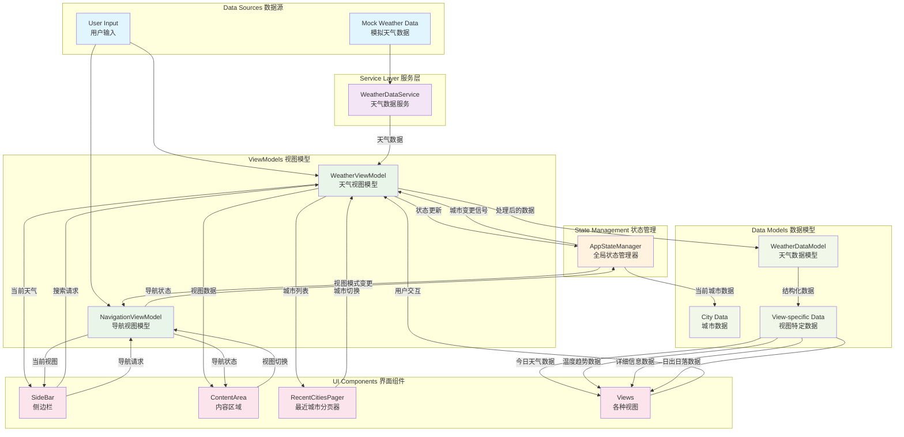
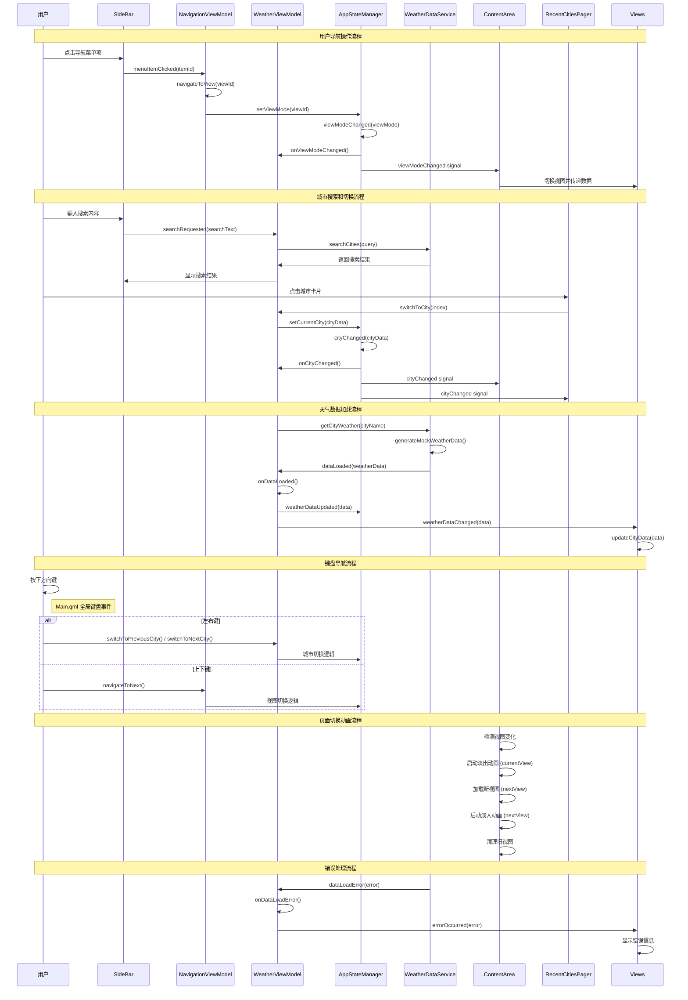

# WeatherAPP QMLFrontend 架构图

## 1. 程序架构图 (Program Architecture)

```mermaid
graph TB
    subgraph "Main Application"
        Main["Main.qml<br/>应用程序入口"]
    end
    
    subgraph "Models Layer 数据模型层"
        ASM["AppStateManager<br/>全局状态管理器"]
        WDM["WeatherDataModel<br/>天气数据模型"]
    end
    
    subgraph "Services Layer 服务层"
        WDS["WeatherDataService<br/>天气数据服务"]
    end
    
    subgraph "ViewModels Layer 视图模型层"
        WVM["WeatherViewModel<br/>天气视图模型"]
        NVM["NavigationViewModel<br/>导航视图模型"]
    end
    
    subgraph "Layouts Layer 布局层"
        SB["SideBar<br/>侧边栏"]
        CA["ContentArea<br/>内容区域"]
        RCP["RecentCitiesPager<br/>最近城市分页器"]
    end
    
    subgraph "Views Layer 视图层"
        BV["BaseView<br/>视图基类"]
        TWV["TodayWeatherView<br/>今日天气视图"]
        TTV["TemperatureTrendView<br/>温度趋势视图"]
        DIV["DetailedInfoView<br/>详细信息视图"]
        SSV["SunriseSunsetView<br/>日出日落视图"]
    end
    
    subgraph "Components Layer 组件层"
        subgraph "Common Components"
            WC["WindowControls<br/>窗口控制"]
            SBar["SearchBar<br/>搜索栏"]
            DA["DragArea<br/>拖拽区域"]
        end
        
        subgraph "Navigation Components"
            NM["NavigationMenu<br/>导航菜单"]
            MI["MenuItem<br/>菜单项"]
        end
        
        subgraph "Weather Components"
            TWI["TodaysWeatherItem<br/>今日天气项"]
            TTI["TempratureTrendItem<br/>温度趋势项"]
            DII["DetailedInfoItem<br/>详细信息项"]
        end
        
        subgraph "City Pager Components"
            RCM["RecentCitiesManager<br/>最近城市管理器"]
            CDC["CityDisplayCard<br/>城市显示卡片"]
            PI["PageIndicator<br/>分页指示器"]
        end
    end
    
    subgraph "Animations Layer 动画层"
        GE["GlassEffect<br/>玻璃效果"]
        EBE["EdgeBlurEffect<br/>边缘模糊效果"]
        GB["GradientBackground<br/>渐变背景"]
        CAS["ContentAreaStyle<br/>内容区域样式"]
        SS["SidebarStyle<br/>侧边栏样式"]
        RCPS["RecentCitiesPagerStyle<br/>分页器样式"]
    end
    
    %% 依赖关系
    Main --> ASM
    Main --> WVM
    Main --> NVM
    Main --> SB
    Main --> CA
    Main --> RCP
    
    WVM --> ASM
    WVM --> WDS
    WVM --> WDM
    NVM --> ASM
    
    SB --> NVM
    SB --> WVM
    SB --> WC
    SB --> SBar
    SB --> DA
    SB --> NM
    SB --> SS
    
    CA --> NVM
    CA --> WVM
    CA --> BV
    CA --> CAS
    
    RCP --> RCM
    RCP --> RCPS
    
    BV --> TWV
    BV --> TTV
    BV --> DIV
    BV --> SSV
    
    TWV --> TWI
    TTV --> TTI
    DIV --> DII
    
    RCM --> CDC
    RCM --> PI
    RCM --> GE
    
    NM --> MI
    
    %% 样式依赖
    SB -.-> SS
    CA -.-> CAS
    RCP -.-> RCPS
    RCM -.-> GE
```

## 2. 数据流结构图 (Data Flow Architecture)

## 3. 信号传递图 (Signal Flow Diagram)

## 架构说明

### 1. 程序架构特点
- **分层架构**: 采用经典的分层架构模式，从底层的数据模型到顶层的UI组件
- **MVVM模式**: 使用Model-View-ViewModel模式，实现数据与视图的分离
- **组件化设计**: 高度模块化的组件设计，便于维护和复用
- **状态集中管理**: 通过AppStateManager实现全局状态的统一管理

### 2. 数据流特点
- **单向数据流**: 数据从服务层流向视图层，保证数据流向清晰
- **响应式更新**: 基于QML信号槽机制实现响应式数据更新
- **视图特定数据**: 根据不同视图模式提供相应的数据结构

### 3. 信号传递特点
- **事件驱动**: 基于QML信号槽机制实现组件间通信
- **松耦合**: 组件间通过信号进行通信，降低耦合度
- **异步处理**: 数据加载和UI更新采用异步方式，提升用户体验